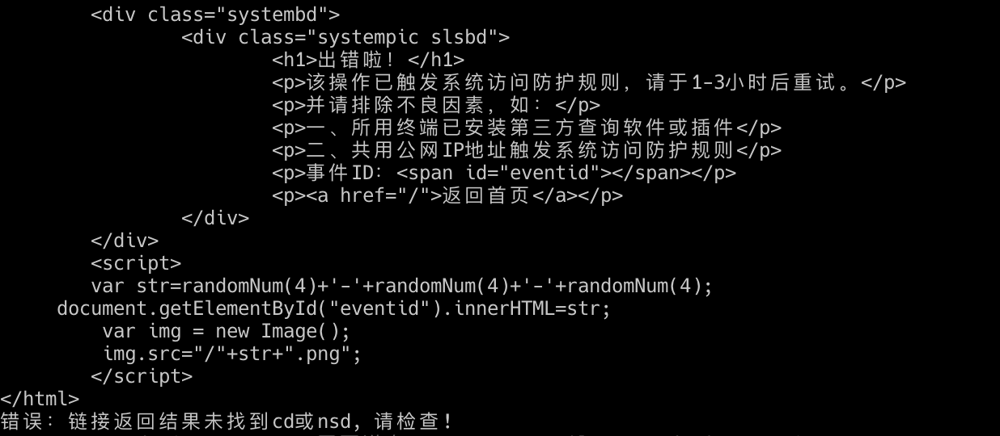
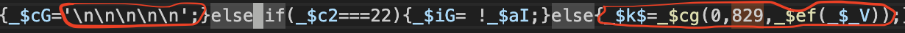
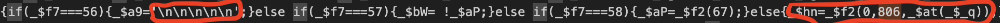

该项目为瑞数加密的逆向研究，代码开发基于网站：`https://wcjs.sbj.cnipa.gov.cn/sgtmi`

研究包括动态代码生成原理及动态cookie生成原理。

**作者最新开源项目(补环境框架sdenv)推荐：[sdenv](https://github.com/pysunday/sdenv)**

## 0. 声明

该项目下代码仅用于个人学习、研究或欣赏。通过使用该仓库相关代码产生的风险与仓库代码作者无关！

该项目的研究网站仅做参考，项目不鼓励直接请求该研究网站，算法逆向研究请直接使用`example`目录下的样例文件，如：`node main.js makecookie`(默认为最新版本代码)。

## 1. 博客文章

1. [瑞数vmp-代码格式化后无法正常运行原因分析](https://howduudu.tech/#/blog/article/1699807978000)
2. [瑞数vmp-动态代码生成原理](https://howduudu.tech/#/blog/article/1701276778000)
3. [补环境-document.all的c++方案](https://howduudu.tech/#/blog/article/1702313578000)

## 2. 瑞数算法还原

**`npx rs-reverse *`与在当前目录下运行`node main.js *`相对应, 当然也支持npm全局安装(`npm install -g rs-reverse`)，npm全局安装后也可以直接使用命令`rs-reverse`**

如npx运行的包不是最新的，可以加上-p参数后执行如：`npx -p rs-reverse@latest rs-reverse makecookie`，非官方源可能存在版本不同步问题，建议拉取时使用官方源：`--registry=https://registry.npmjs.org`。

npm包不能保证最新代码，最新代码以仓库代码为准!

### 2.1. makecode子命令

执行子命令`makecode`生成动态代码, 可以传入包含`$_ts.nsd`和`$_ts.cd`的文本文件或者直接给url让程序自己去拿，命令示例:

1. npx方式：`npx rs-reverse makecode`
2. 文件方式：`node main.js makecode`

**命令后不接参数则从example文件中取**

```console
 $ npx rs-reverse makecode -h
rs-reverse makecode

接收ts.json文件生成immucfg、ts、ts-full文件，如果传入的是url则还会生成html、主代
码、动态代码文件，还可通过-j命令接收多个$_ts.l__处理的文件url并生成该js文件及解
密后的js文件。

**`-j`参数需要注意，链接地址必须带上查询参数，不带的话返回的是未经过瑞数处理的文件，可以从浏览器控制台查看带参数的完整地址，如果待解密的js文件存在多个时，为了保证结果中变量名与瑞数解析的变量名一致，需要按浏览器的解析顺序依序传入（因为变量名存在复用逻辑）。**

Options:
  -h             显示帮助信息                                          [boolean]
  -f, --file     含有nsd, cd值的json文件                                [string]
  -l, --level    日志打印等级，参考log4js，默认为info                   [string]
  -u, --url      瑞数返回204状态码的请求地址                            [string]
  -a, --adapt    已经做了适配的网站名称，不传则为cnipa                  [string]
  -j, --jsurls   $_ts.__l方法执行的js文件链接(必须带上查询参数)，多个时需要按顺
                 序传入，如：-j "https://host/chunk.js?4VGu1xaT=a728b2" -j
                 "https://host/app.js?4VGu1xaT=a728b2"                   [array]
  -v, --version  显示版本号
```

调用示例：

```bash
 $ npx rs-reverse makecode -u https://wcjs.sbj.cnipa.gov.cn/sgtmi -j 'https://wcjs.sbj.cnipa.gov.cn/js/chunk-vendors.66e24864.js?查询参数' -j 'https://wcjs.sbj.cnipa.gov.cn/js/app.9f7a91c9.js?查询参数'

  url方式提取的ts：output/makecode/ts.json
  url方式提取的静态文本：output/makecode/immucfg.json
  程序生成的ts：output/makecode/ts-full.json
  url方式提取的html代码：output/makecode/sgtmi.html
  url方式提取的javascript代码：output/makecode/cCdzB9ZjDFks.a728b22.js
  cCdzB9ZjDFks.a728b22.js生成的动态代码：output/makecode/cCdzB9ZjDFks.a728b22-dynamic.js
  url方式提取的javascript代码：output/makecode/chunk-vendors.66e24864.js
  chunk-vendors.66e24864.js生成的解密代码：output/makecode/chunk-vendors.66e24864-decrypt.js
  url方式提取的javascript代码：output/makecode/app.9f7a91c9.js
  app.9f7a91c9.js生成的解密代码：output/makecode/app.9f7a91c9-decrypt.js

```

### 2.2. makecookie子命令

执行子命令`makecookie`生成cookie, 调用方式与`makecode`类型，调用示例：

1. npx方式：`npx rs-reverse makecookie`
2. 文件方式：`node main.js makecookie`

该命令首先会执行`makecode`子命令拿到完整的`$_ts`值，再运行`makecookie`的还原算法生成cookie。

```console
 $ npx rs-reverse makecookie -h
rs-reverse makecookie

生成cookie值并打印

Options:
  -h             显示帮助信息                                          [boolean]
  -f, --file     含有nsd, cd值的json文件                                [string]
  -l, --level    日志打印等级，参考log4js，默认为info                   [string]
  -u, --url      瑞数返回204状态码的请求地址                            [string]
  -a, --adapt    已经做了适配的网站名称，不传则为cnipa                  [string]
  -v, --version  显示版本号                                            [boolean]
```

调用示例：

```bash
 $ npx rs-reverse makecookie -u https://wcjs.sbj.cnipa.gov.cn/sgtmi

  存在meta-content值：n5fQ9G1lGvUzfS_yMHx30yYAbp2_NDZI 解析结果：/sgtmi

  Cookie值: 0yk64LrpoFnc8Wi4Mmu_rijgRRoC2SHY1bQlR2_QZ805_CqRd1uOgGRnlEvHvXSoQuwkx_fwn4iQnPDFrQigm1b4GnD61Pf9vU5XKtJtAWIoWeG_22OLiccUwGjI0lQaJ_jaYIBFygNsPSPf_0GnJyT1umFrFgAkAoqh1s0G9IDE1uPEM3PV8M1J.wbKdSgMLg8T3bGD5w2sHHohKfnwsT7bMNbb8xbjSxsn8qb8AvY0
  Cookie长: 236

```

### 2.3. makecode-high子命令

执行子命令`makecode-high`生成网站代码，解码两次请求返回的网站代码(功能涵盖makecode子命令)，调用示例：

1. npx方式：`npx rs-reverse makecode-high -u url`
2. 文件方式：`node main.js makecode-high -u url`

该命令第一次请求生成cookie带入第二次请求，将两次请求返回的加密代码及动态代码解码后保存到`output/makecode-high`目录中，和makecode命令区别为该命令只提供-u方式执行!

需要注意的是，请避免连续执行该命令以免触发风控报错，报错如：



```console
 $ npx rs-reverse makecode-high -h
rs-reverse makecode-high

解码两次请求返回的网站代码(功能涵盖makecode子命令)

Options:
  -h             显示帮助信息                                          [boolean]
  -l, --level    日志打印等级，参考log4js，默认为info                   [string]
  -u, --url      瑞数返回204状态码的请求地址                 [string] [required]
  -a, --adapt    已经做了适配的网站名称，不传则为cnipa                  [string]
  -v, --version  显示版本号                                            [boolean]

Examples:
  rs-reverse makecode-high -u http://url/path
```

调用示例：

```bash
 $ npx rs-reverse makecode-high -u https://wcjs.sbj.cnipa.gov.cn/sgtmi

第1次请求：

  url方式提取的ts：output/makecode-high/first/ts.json
  url方式提取的静态文本：output/makecode-high/first/immucfg.json
  程序生成的ts：output/makecode-high/first/ts-full.json
  url方式提取的javascript代码：output/makecode-high/first/cCdzB9ZjDFks.a728b22.js
  url方式提取的html代码：output/makecode-high/first/sgtmi.html
  cCdzB9ZjDFks.a728b22.js生成的动态代码：output/makecode-high/first/cCdzB9ZjDFks.a728b22-dynamic.js

第2次请求：

  url方式提取的ts：output/makecode-high/second/ts.json
  url方式提取的静态文本：output/makecode-high/second/immucfg.json
  程序生成的ts：output/makecode-high/second/ts-full.json
  url方式提取的javascript代码：output/makecode-high/second/cCdzB9ZjDFks.a728b22.js
  url方式提取的html代码：output/makecode-high/second/sgtmi.html
  cCdzB9ZjDFks.a728b22.js生成的动态代码：output/makecode-high/second/cCdzB9ZjDFks.a728b22-dynamic.js
  url方式提取的javascript代码：output/makecode-high/second/chunk-vendors.66e24864.js
  url方式提取的javascript代码：output/makecode-high/second/app.9f7a91c9.js
  chunk-vendors.66e24864.js生成的解密代码：output/makecode-high/second/chunk-vendors.66e24864-decrypt.js
  app.9f7a91c9.js生成的解密代码：output/makecode-high/second/app.9f7a91c9-decrypt.js

```

### 2.4. exec子命令

exec子命令用于开发中或者演示时使用。命令示例：

1. npx方式：`npx rs-reverse exec -c 'gv.cp2'`
2. 文件方式：`node main.js exec -c 'gv.cp2'`

```console
 $ npx rs-reverse exec -h
rs-reverse exec

直接运行代码，用于开发及演示时使用

Options:
  -h             显示帮助信息                                          [boolean]
  -l, --level    日志打印等级，参考log4js，默认为info                   [string]
  -c, --code     要运行的代码，如：gv.cp2，即打印cp2的值     [string] [required]
  -v, --version  显示版本号                                            [boolean]

Examples:
  rs-reverse exec -c 'code string'
```

调用示例：

```bash
 $ npx rs-reverse exec -c '+ascii2string(gv.keys[21])'

  输入：+ascii2string(gv.keys[21])
  输出：1718026159

```

## 3. 其它

### 3.1. 网站兼容与适配

适配文件配置在目录`./src/adapt/`下，已完成兼容配置：

网站 | 名称 | makecode | makecookie | makecode-high | 适配版本 | 是否逆向验证
---- | ---- | -------- | ---------- | ------------- | -------- | --------------
商标网 | cnipa | 👌 | 👌 | 👌 | - | Y
瑞数官网 | riversecurity | 👌 | 👌 | N | 版本1 | N

以瑞数官网实例如：`npx rs-reverse makecookie -u https://www.riversecurity.com/resources.shtml -a riversecurity`

具体配置说明请看文档：`./src/adapt/README.md`

### 3.2. 静态文本

当使用本地方式生成动态代码或者cookie时需要预先配置静态文本，远程方式由于会动态解析，因此远程方式不需要配置，静态文本配置文件：`./src/config/immucfg_v*.json`，里面包含`cp0`、`cp2`、`globalText1`、`globalText2`、`globalText3`等静态文本字段，您可以通过远程命令动态生成，如通过makecode命令加远程网址`-u https://wcjs.sbj.cnipa.gov.cn/sgtmi`，执行后生成文件`./output/makecode_input_immucfg.json`即为静态文本配置文件。

### 3.3. 可变配置项

配置文件地址：`./src/config/index.js`，在网站版本更新后需要修改该文件下配置文件以达到继续适配，配置项说明如下

#### 3.3.1. keynameNum

该配置项用于控制变量名数组生成数量，即`$_ts.cp[1]`的值，具体原理请看前面博客文章，该值会在每次网站更新后发生变动，可以通过查看js文件，搜索`\n\n\n\n`，在搜索结果后面不远处就可以找到，如：

1. 代码`_$hn=_$f2(0,806,_$at(_$_q))`中的`806`
    
2. 代码`_$k$=_$cg(0,829,_$ef(_$_V))`中的`829`
    

#### 3.3.2. offsetConst

动态代码中生成8位解密用的偏移值数组使用，主要是里面的键值是任务数组中的值了，由于瑞数的任务树是打包时动态生成，且值为任务树中最顶层任务生成，不好获取，因此写死，键值可以在gv.r2mka('0-0').task中找到，也可以通过动态代码执行报错获取键值。

#### 3.3.3. codemap

瑞数主体循环方法生成的配置文件，用于动态代码使用。

#### 3.3.3. immucfg

该项为版本固定值，当网站未更新时值是不会变的，当需要配置时可以通过`makecode -u url`方式动态生成，如执行：`node main.js makecode -u https://wcjs.sbj.cnipa.gov.cn/sgtmi`后生成的`output/makecode_input_immucfg.json`文件。

## 4. 技术交流

加作者微信进技术交流群: `howduudu_tech`(备注rs-reverse)

订阅号会定期发表技术文章：码功
